 

## 🧭 About Me

<table>
<tr>
<td>

I'm currently pursuing a **B.Tech in Cybersecurity**, working at the intersection of three domains I'm most drawn to:

- 🌐 **Web Development**
- 🔐 **Cybersecurity**
- ☁️ **DevOps**

I'm especially interested in bringing **Artificial Intelligence** into each of these — building web platforms, security tooling, and DevOps pipelines that are smarter, not just functional. My goal is simple: build technology that is **practical, intelligent, secure, and scalable**.

</td>
</tr>
</table>

> *"Technology evolves because engineers refuse to accept today's limitations as tomorrow's reality."*

 

---

## 💼 Experience

### 🚓 Cyber Police Internship
`[INTERNSHIP DURATION]` · `[LOCATION / DEPARTMENT]`

During my internship with the **Cyber Police**, I gained hands-on exposure to cybersecurity operations, cybercrime-related casework, and real-world technical problem solving — bridging the gap between classroom theory and applied security practice.

**Key contributions:**

- 🖼️ **Selfie-Based Attendance Marker** — Worked on a selfie-based attendance marking system as part of internal process improvement, applying practical technical problem-solving to a real operational need.
- 💰 **Financial Recovery Assistance** — Assisted in a case that led to the successful recovery of approximately **₹56,000** for an affected individual.

 

---

## 🛠️ Tech Stack

### 🌐 Web Development

**Frontend**

**Backend**

**Database**

**APIs**

 

### 🔐 Cybersecurity

**Security Tools**

**Security Technologies**

**Python / Security Libraries**

**Cybersecurity Skills**

`Network Security` · `Vulnerability Assessment` · `Digital Forensics` · `Cybercrime Investigation` · `Ethical Hacking`

 

### ☁️ DevOps

**Containers**

**CI/CD**

**Cloud**

**Deployment**

**Version Control**

 

---

## 🏆 Achievements

<table>
<tr>
<td width="33%" valign="top">

**📺 LinkedIn Tech Channel**

Built a tech-focused LinkedIn channel centered on content creation, sharing technical knowledge with a growing community.

[Visit Channel →](#) `[LINKEDIN CHANNEL URL]`

</td>
<td width="33%" valign="top">

**🥇 Best Academic Project**

Awarded **₹10,000** for Best Academic Project, recognizing excellence in applied technical work.

</td>
<td width="33%" valign="top">

**📄 Research Paper — BadUSB**

Published research on **BadUSB**, exploring its mechanisms and security implications.

[Read Paper →](#) `[RESEARCH PAPER LINK]`

</td>
</tr>
</table>

 

---

## 🌐 Let's Connect

 

---

## 📊 GitHub Activity

 

 

---

**Built with ❤️ and curiosity by Ashutosh dixit.**

